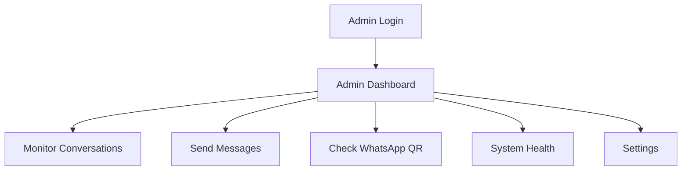

## 1. Product Overview

Admin page for WhatsApp-GHL integration system. Provides real-time monitoring of conversations, message management, WhatsApp connection status, and system health monitoring.

## 2. Core Features

### 2.1 User Roles

| Role  | Registration Method          | Core Permissions                  |
| ----- | ---------------------------- | --------------------------------- |
| Admin | Manual setup via environment | Full access to all admin features |

### 2.2 Feature Module

Admin dashboard requirements consist of the following main pages:

1. **Admin Dashboard**: real-time conversation monitoring, message sending interface, WhatsApp QR code display, system health indicators, basic settings.

### 2.3 Page Details

| Page Name       | Module Name          | Feature description                                                                                                              |
| --------------- | -------------------- | -------------------------------------------------------------------------------------------------------------------------------- |
| Admin Dashboard | Conversation Monitor | Display real-time WhatsApp conversations with contact info, message history, timestamp. Auto-refresh every 5 seconds.            |
| Admin Dashboard | Message Composer     | Send manual WhatsApp messages to any phone number. Input field with phone validation, message text area, send button.            |
| Admin Dashboard | WhatsApp Connection  | Show QR code for WhatsApp Web connection. Display connection status (connected/disconnected). Auto-refresh QR code when expired. |
| Admin Dashboard | System Health        | Show service status indicators for WhatsApp, GHL API, AI Agent. Display response times and error counts.                         |
| Admin Dashboard | Settings Panel       | Configure webhook secrets, AI agent endpoints, message templates. Save/reset functionality.                                      |

## 3. Core Process

Admin Flow:in → Dashboard → Monitor conversations → Send messages → Check system health → Manage settings

## 4. User Interface Design

### 4.1 Design Style

* Primary color: #2563eb (blue), Secondary: #64748b (gray)

* Rounded buttons with subtle shadows

* Inter font family, 14px base size

* Card-based

